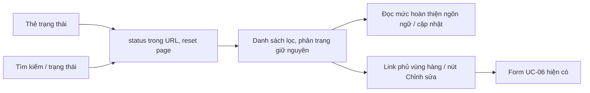

# LocationList — thiết kế theo công việc biên tập UC-06

Người thao tác: Content Admin/Editor vừa chuẩn bị kịch bản hoặc audio, cần tìm địa điểm và mở đúng bản để sửa/gửi duyệt. Giữ filter/query, pagination, trạng thái và bảo vệ published hiện tại. Hướng thiết kế được xác định bởi bảy yêu cầu người dùng; không mở rộng nghiệp vụ.

## Hướng đã được yêu cầu

- **Domain:** địa điểm, tọa độ GPS, vùng geofence, ngôn ngữ, kịch bản FULL/SHORT, audio, bản làm việc, bản published.
- **Color world:** giấy bản thảo trắng ngà, mực đen ấm, đá xám, biển chỉ dẫn xanh đậm, dấu cảnh báo hổ phách, bút kiểm lỗi đỏ. Giữ shell hiện có; chỉ dùng một màu mực cho thao tác LocationList, màu trạng thái có ý nghĩa.
- **Signature:** ma trận ngôn ngữ nằm trong từng hàng địa điểm; đọc được kịch bản/audio thiếu gì mà không mở form. Chip có biểu tượng, tooltip khi hover/focus, aria-label; audio tùy chọn theo PRD, không coi thiếu audio là điều kiện chặn gửi duyệt.
- **Reject:** KPI cards lớn → dải số liệu compact dùng nút lọc; icon trang trí/ID kỹ thuật → tên địa điểm và dữ liệu biên tập; shadow/bo góc mạnh → border nhẹ/radius nhỏ; palette teal trang trí → surface trung tính, màu chỉ dùng để biểu thị tương tác/trạng thái.

## Luồng trước khi chỉnh code

Table semantic giữ nguyên th/tr/td: Link ở tên dùng vùng phủ CSS theo hàng, không bọc tr bằng a, không đặt onClick trên tr. Link Chỉnh sửa độc lập có tên truy cập chứa tên địa điểm. Chip tooltip ở layer cao hơn vùng Link, hỗ trợ focus/Escape; không tạo liên kết lồng nhau. Ctrl/Cmd/middle-click dùng hành vi Link native.

Tọa độ cùng dòng, Intl vi-VN, tabular nums, có Lat/Lng cho screen reader. Cập nhật dùng timestamp ISO + Intl vi-VN. Input và select cùng class/height. Chữ phụ của LocationList và shell tối thiểu 12px.

## Dữ liệu fixture

Không tự động reset localStorage hoặc ghi đè tọa độ/audio của bản đã được người dùng lưu. Fixture mới có GPS nguồn bản đồ, timestamp khác nhau, bản dịch thiếu, audio mẫu hợp lệ và tệp audio mẫu lỗi. Audio mẫu chỉ dùng kiểm tra player, không phải thuyết minh đã duyệt. Ngôn ngữ VI/EN/FR theo cấu hình hiện tại, không tự thêm JA vào sản phẩm.

## Skill áp dụng

Tọa độ tham chiếu đã đối chiếu ngày 07/10/2026 (tâm địa điểm hoặc điểm trên tuyến, không phải số đo cổng vào/geofence đã khảo sát):

| Địa điểm | Lat / Lng | Nguồn |
|---|---|---|
| Bưu điện Trung tâm | 10.77998 / 106.70002 | [Mapcarta / OpenStreetMap](https://mapcarta.com/24884848) |
| Dinh Độc Lập | 10.77702 / 106.6954 | [Mapcarta / OpenStreetMap](https://mapcarta.com/24884854) |
| Chợ Bến Thành | 10.77257 / 106.69802 | [Mapcarta / OpenStreetMap](https://mapcarta.com/W39514795) |
| Nhà thờ Đức Bà | 10.77977 / 106.69906 | [Mapcarta / OpenStreetMap](https://mapcarta.com/W801950766) |
| Bảo tàng Lịch sử | 10.78484 / 106.70759 | [Ho Chi Minh City Museum of History](https://culturalheritageonline.com/places/ho-chi-minh-city-museum-of-history/) |
| Phố đi bộ Nguyễn Huệ | 10.774112 / 106.703619 | [Nguyễn Huệ Boulevard](https://en.wikipedia.org/wiki/Nguy%E1%BB%85n_Hu%E1%BB%87_Boulevard) |

Timestamp của fixture là dữ liệu mô phỏng với các ngày/giờ khác nhau. Metadata cập nhật được ghi khi lưu form; không thay đổi workflow DRAFT/PENDING_REVIEW. `public/audio/preview.wav` là tone kiểm thử, `broken.wav` cố ý lỗi. Script tái tạo: `web-admin/scripts/create-audio-fixtures.mjs`.

- `.agents/skills/frontend-design-principles/SKILL.md` và `app.md`: precision/density và color-for-meaning.
- `.agents/skills/frontend-ui-engineering/SKILL.md`: semantic, content-first, states, typography, keyboard và responsive.
- `.agents/skills/web-design-guidelines/command.md`: review sau sửa.
