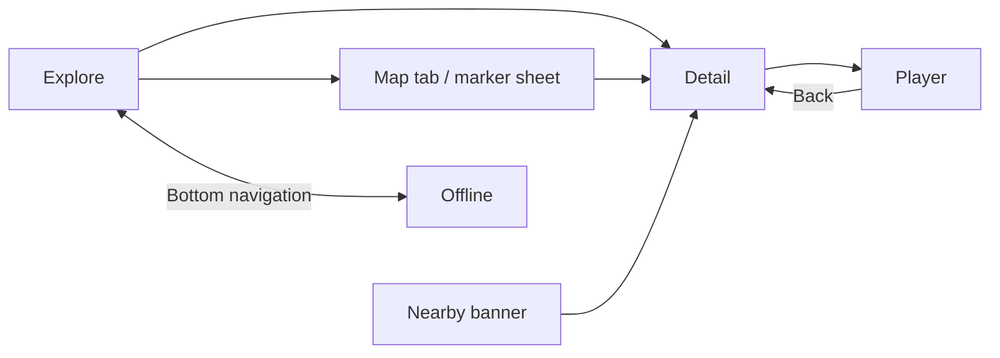

# Android UI Demo

## Purpose

HVP-22: UI-only Android prototype based on `docs/en/PRD_Report.md` (UC-01–UC-05). The attachment's `docs/PRD.md` is absent. UC-06/UC-07 remain in web admin. Uses installed `android-compose-design` in place of the previous two unavailable skill names.

## Implemented Screens

- Explore: nearby, keyword, category, loading/error/empty/GPS-denied; mock map, pan/zoom, accessible markers and bottom sheet.
- Detail: multilingual guide fixture, FULL/SHORT, language fallback, loading/unavailable content and fake feedback.
- Player: matching location/language/mode, fake progress, pause/resume/seek/speed, TTS fallback and interruption/headphone-disconnect simulation.
- Offline: protected base, optional versioned package, confirmed update/progress/verification, network/storage/integrity failures, confirmed optional deletion.
- UC-05 banner in Explore: valid/invalid ID, cooldown, foreground/no-permission. Content language selection carries across navigation to banner text.

## Navigation

Routes: `explore`, `offline`, `detail/{id}`, `player/{id}/{language}/{mode}`. Map is inside Explore. Top-level tabs use single-top and save/restore state; Android Back uses Navigation Compose. Banner opens Detail without starting player.

## Mocked Features

Static `DemoData`, small local UI selections and composition-scoped fake progress. No data collection. Six illustrative locations; nearby default 500 m entries are 120/280/430 m. Other entries can be searched manually.

No production language/catalog/package policy is inferred from pending PRD proposals. VI/EN/JA, versions and sizes are presentation fixtures. Package safety is illustrated rather than implemented.

## Figma

No file URL/node was supplied. Existing five screenshots in `docs/ui_requirments/` supply visual direction, so implementation does not create an unrelated blank Figma file. Green/off-white Material 3 roles, vector placeholders and 48 dp controls follow references while correcting nearby distances to PRD 50–500 m.

## How to Run

Open `android/` in Android Studio, run `app` on API 26+. [android/README.md](../../android/README.md) provides PowerShell commands, dependency pins, APK path and Windows JDK workaround. No login/server prerequisite.

Host UI tests/captures: `:app:testDebugUnitTest`; device tests: `:app:connectedDebugAndroidTest`. Compiling tests is distinct from executing them. [ui-review.md](ui-review.md) records actual evidence and unverified checks.

## Demo captures

Host-rendered activity captures, inspected after the final UI fixes. These are Robolectric Canvas renders, not device screenshots or Android Studio Preview output.

| Explore | Detail | Player | Offline | Map at 320 dp |
| --- | --- | --- | --- | --- |
| [View](previews/explore.png) | [View](previews/detail.png) | [View](previews/player.png) | [View](previews/offline.png) | [View](previews/map-320.png) |

## Out of Scope

No backend, API/networking, authentication, GPS, maps service, geofences, TTS/audio playback, database, offline persistence, real permissions, analytics, DI, complex ViewModels or production business logic. Manifest has no network/location/storage/notification permissions.

The translations, device events and package states are simulated; this prototype does not establish production content integrity/location accuracy/offline reliability.
