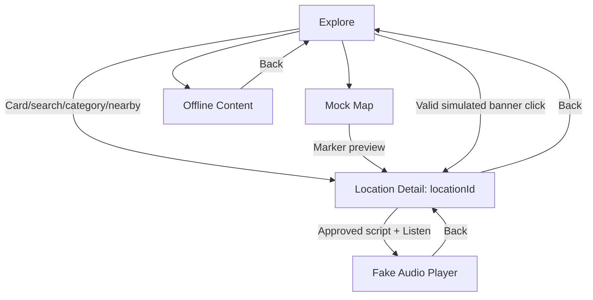

# Android UI Demo Requirements

## Source and scope

Task: **HVP-22**. Source of truth: `docs/en/PRD_Report.md`, UC-01–UC-05 and its publication dependency. The attachment refers to `docs/PRD.md`, which does not exist in this checkout; this document uses the existing PRD without copying or replacing it. UC-06 and UC-07 remain in the existing web admin.

Primary actor: Tourist. Product capabilities: explore/select a location, read multilingual approved content, listen with controls/fallback, manage offline content, and open a location from a nearby notification. These are capabilities grouped for the prototype, not newly created backlog epics.

The installed `android-compose-design` skill covers Android design and Compose engineering. The previous skill names `mobile-android-design` and `compose-pro` are absent. The explicit latest request to recheck skills and implement the demo uses the available replacement.

## Core User Flow

1. Explore → nearby shortlist, keyword results, category results, or mock map.
2. Select a location → Location Detail with language and FULL/SHORT selection.
3. Listen → fake player; pause/resume/seek/speed and simulated fallback states.
4. Open Offline Content → confirm a mock update, inspect progress/result, or confirm removal of optional content.
5. Select a simulated nearby banner → the matching Location Detail, without automatically playing audio.

GPS permission denial does not block manual exploration. Base offline content is already available without a prior download. Only fixture content marked APPROVED is presented to tourists.

## Screens

### Screen 01 — Explore

Purpose: Start location discovery without requiring real permission or GPS.
Related UC: UC-01 basic flow, A1/A2/A4, E1–E4, BR1–BR4; UC-05 A2.
Entry: App start or bottom navigation/back.
Exit: Mock Map, Location Detail, Offline Content.
Main UI: Search field, category chips, nearby action, radius choice within 50–500 m, location cards with name/category/distance, nearby banner when explicitly simulated.
States: Content, loading, nearby unavailable/permission denied, no nearby results, no keyword matches, empty category, long names. GPS status and distance are illustrative values, not device observations.
Actions: Find nearby, change radius, search, choose category, select a card, switch to map, continue manual search after error, open banner.
Constraints: Nearby fixture shortlist has 3–5 items ordered by displayed distance; no list page exceeds 20 items. Manual methods remain usable in every GPS error state.

### Screen 02 — Mock Map

Purpose: Demonstrate marker selection and preview sheet without a maps SDK.
Related UC: UC-01 A3; E1 manual alternative.
Entry: Explore map action/navigation.
Exit: Location Detail from marker preview, Explore via Back.
Main UI: Clearly identified schematic map placeholder, selectable markers, selected-location bottom sheet/card, open-location action.
States: Unselected map, selected marker, empty location set, long preview text.
Actions: Select marker, dismiss preview, open selected location, return.
Constraints: Marker controls have spoken labels; map appearance is not a real navigation or geographic accuracy claim. Pan/zoom, if represented, changes only the local placeholder presentation.

### Screen 03 — Location Detail

Purpose: Read the approved guide for the selected location and language/duration.
Related UC: UC-02 basic flow, A1/A2, E1/E2, BR1/BR2; entry target of UC-05.
Entry: Location card, map preview, simulated valid notification/banner.
Exit: Fake Audio Player, feedback notice, previous destination.
Main UI: Location heading/placeholder image, category, language picker, FULL/SHORT segmented choice, readable guide text, Listen action, translation/fallback notice when relevant.
States: Loading, approved FULL content, approved SHORT content, selected-language unavailable with EN then VI fixture fallback, no approved content with listen disabled and Send Feedback action, long text.
Actions: Change language while retaining location and duration; change duration while retaining location and language; listen; display a non-submitting feedback notice; Back.
Constraints: No DRAFT/PENDING_REVIEW text appears. Fallback changes the displayed content language visibly; it does not silently claim the selected translation exists. No content means no player session.

### Screen 04 — Audio Player

Purpose: Show playback interactions and recovery without audio services or TTS.
Related UC: UC-03 basic flow, A1, E1–E3, BR1/BR2.
Entry: Listen on a detail with approved script available.
Exit: Back to the same location/language/duration detail.
Main UI: Location title, content language/duration, fake elapsed/total time, progress slider, play/pause, seek backward/forward, speed choice, prerecorded/TTS-fallback status.
States: Preparing, playing, paused, complete; unavailable/broken audio → simulated TTS fallback; simulated audio-focus interruption or headphone disconnect → paused with retained displayed position.
Actions: Play/pause/resume, seek, speed select, simulate interruption/disconnect/fallback, Back.
Constraints: The title/language/duration match the selected detail. Opening the page does not run an actual audio stream; elapsed position is local UI state. Banner navigation never automatically plays.

### Screen 05 — Offline Content

Purpose: Demonstrate safe update/removal decisions while protecting bundled base content.
Related UC: UC-04 basic flow, A1–A3, E1–E3, BR-01–BR-04.
Entry: Explore navigation/action.
Exit: Explore via Back/navigation.
Main UI: Base content badge, optional package cards, installed version, update availability/new version/size, check-update action, confirmation dialog, fake progress, optional delete confirmation.
States: Installed/offline-ready, checking, update available, no update, downloading, download paused with progress retained, insufficient storage, invalid package, success, optional content removed.
Actions: Check, confirm/cancel update, advance/pause/resume fake progress, retry, confirm/cancel optional deletion.
Constraints: Base package has no deletion action. Installed version changes only when the success fixture is selected; canceled/failed updates leave it visibly unchanged. Package group names/sizes are illustrative fixtures, not a confirmed grouping architecture.

### Screen 06 — Notification scenario surface

Purpose: Demonstrate UC-05 through an in-app banner and explicit scenario controls rather than adding a tourist notification-inbox feature absent from the PRD.
Related UC: UC-05 basic flow, A1–A4, E1–E3, BR1–BR4.
Entry: Demo scenario picker on Explore.
Exit: Correct Location Detail for a valid banner selection, otherwise remain in Explore.
Main UI: Current-language nearby banner with localized verified fixture location name; visible scenario explanation for permission/cooldown/invalid ID.
States: Valid foreground banner, multiple-geofence fixture prioritizing nearest, location permission unavailable, notification permission unavailable with foreground banner possible, cooldown suppression, invalid location ID notice, banner dismissed/ignored.
Actions: Simulate a scenario, open banner, ignore/dismiss.
Constraints: No actual notifications, permissions, sensors, or geofence registrations. No navigation without a click. Invalid ID never routes to a fabricated location.

## Shared Components

Top app bar; accessible bottom navigation; location card; category chip; language picker; duration selector; schematic map and marker/preview; guide text section; fake audio controls; offline package card; download progress; confirmation dialog; empty/error/loading panels; scenario selector; nearby banner. Reuse only components with repeated UI needs, using values and callbacks.

## Navigation Graph

The detail origin should be preserved when opened from Map, so Back returns there. The diagram summarizes the core flow; no production URL/deep-link contract is introduced.

## Mock Data Requirements

| Fixture | Purpose |
| --- | --- |
| 3–5 nearby locations with ID, localized name, category, displayed distance, coordinates/radius and image placeholder | UC-01 selection and UC-05 routing; coordinate/distance values are static |
| At least one long name and long guide | Layout, wrapping and scrolling |
| VI/EN guide variants with FULL/SHORT; another language missing on a selected location | UC-02 language/duration and fallback |
| Location with no approved guide | UC-02 E2; Listen disabled, feedback notice |
| Valid prerecorded, unavailable/broken-audio fixture | UC-03 source priority and simulated TTS fallback |
| Bundled base and optional approved versioned packages with fixture MB sizes | UC-04 base protection, update/remove/progress |
| Valid/invalid banner locationId, permission/cooldown/no-update/storage/network/integrity scenarios | Alternate and exception states without services |

Pending PRD decisions remain pending. Do not add a reviewer workflow, package grouping contract, new languages contract, content publishing behavior, or persisted settings as if approved. Script/audio optionality is shown only through existing UC-03 fallback behavior.

## Out of Scope

Real GPS/geofences/maps/permissions/notifications; network/API/server; audio playback/TTS; downloads/files/persistence/database; authentication; analytics; production repositories/domain/use cases/DI; mobile publishing/review; UC-06/UC-07 admin pages. Send Feedback is a non-submitting notice because its submission dependency lies outside the seven use cases. Verification may build/install/run this prototype but must not add real services to satisfy a demo check.
