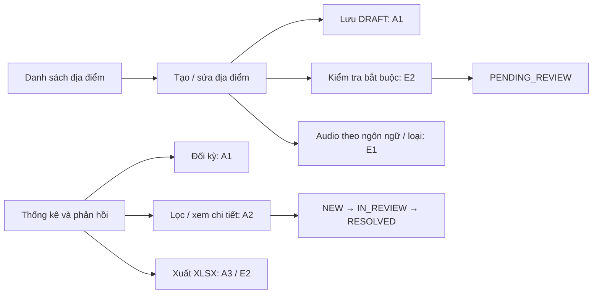

# Thiết kế demo Web Admin — UC-06 / UC-07

Nguồn: `en/PRD_Report.md` mục USECASE 6, 7; đối chiếu `vi/PRD_Report_vi.md`. Đường dẫn `docs/PRD.md` và `docs/PRD_Report.md` trong AGENTS.md không tồn tại. Áp dụng `.agents/skills/web-design-guidelines/command.md`, trừ Hydration Safety và Content & Copy theo AGENTS.md.

## Part 1 — Sitemap và luồng

| Route | Trạng thái URL |
|---|---|
| `/locations` | `q`, `status`, `page`, `scenario` |
| `/locations/new` | `language`, `type`, `scenario` |
| `/locations/:id/edit` | `language`, `type`, `scenario` |
| `/analytics` | `from`, `to`, `category`, `status`, `feedback`, `page`, `scenario` |

`scenario` là công cụ kiểm thử demo: normal / empty / error / long / upload-error / export-error. Không phải chức năng nghiệp vụ. Dữ liệu mock lưu trong localStorage; không gọi backend. Route mặc định là `/locations`. Admin được giả định đã xác thực; không dựng màn hình đăng nhập.

## Màn hình

### LocationList
Mục đích: điểm vào bước 1 UC-06. Bảng tên, nhóm, tọa độ, trạng thái bản làm việc và phiên bản đã xuất bản; liên kết thêm mới/chỉnh sửa. Tìm kiếm, lọc trạng thái, phân trang 10 dòng. Không thêm xóa hoặc duyệt/xuất bản ngoài phạm vi.

Loading: thông báo đang tải. Empty: hướng dẫn thêm mới hoặc bỏ bộ lọc. Error: thông báo và thử lại. Long: chuỗi dài ngắt dòng, bảng cuộn ngang trong vùng riêng, phân trang. A2 mở bản đang sửa; bản APPROVED được giữ riêng.

### LocationForm
Mục đích: UC-06 bước 2–7. Nhóm thông tin địa điểm (tên, danh mục, vĩ độ, kinh độ, bán kính); chọn ngôn ngữ và FULL/SHORT; textarea kịch bản; audio upload, chọn file/drag drop và player native có bàn phím; thông báo BR4; thanh hành động lưu nháp / gửi duyệt.

Loading: tải bản có sẵn. Empty: biểu mẫu tạo mới, audio chưa có. Error: lỗi tải có thử lại; E1 giữ form, chọn lại/retry; E2 lỗi inline và focus đầu tiên. Long: textarea giới hạn chiều cao, nội dung ngắt dòng. A1 lưu thiếu dữ liệu dưới DRAFT; A2 cập nhật bản làm việc, audio một khóa không thay đổi khóa khác. Bản ghi script/audio dùng locationId + languageCode + scriptType + packageVersion. Không có thao tác APPROVED. Cảnh báo trước đóng tab, link nội bộ hoặc Back khi chưa lưu. Sửa bản cũ yêu cầu xác nhận trước lưu theo A2.

### AnalyticsFeedback
Mục đích: UC-07 bước 1–5. Khoảng ngày mặc định 30 ngày theo Asia/Ho_Chi_Minh; bốn khối tổng lượt phát, địa điểm nổi bật, ngôn ngữ, tỷ lệ offline/online. Số liệu có bảng văn bản tương đương. Phản hồi có danh mục, nội dung, đánh giá, trạng thái; chi tiết ở dialog; nút chỉ chuyển bước tiếp theo và thời gian cập nhật. Lọc theo ngày/danh mục/trạng thái, phân trang 10 dòng. XLSX chứa thống kê và toàn bộ phản hồi của kỳ (không chỉ trang đang xem).

Loading: khi tải/đổi kỳ A1. Empty E1: riêng vùng thống kê và phản hồi. Error: lỗi tải/retry; export E2 giữ bộ lọc/chi tiết/dữ liệu, hiển thị retry. Long: line-clamp phản hồi trong bảng, chi tiết ngắt dòng, phân trang. A3 dùng dữ liệu mock lọc theo kỳ. Cập nhật trạng thái lưu timestamp, aria-live, không nhảy bước hoặc mở lại.

## Ánh xạ yêu cầu → Vercel rules

| Yêu cầu | Quy tắc áp dụng |
|---|---|
| UC-06 E2 | label/htmlFor, aria-invalid + aria-describedby, lỗi inline aria-live, focus lỗi đầu tiên |
| UC-06 E1 | dữ liệu form được giữ, retry, chọn file native hỗ trợ bàn phím ngoài drag/drop |
| UC-06 A1/A2/BR4 | nút semantic, xác nhận lưu bản sửa, cảnh báo rời trang, tách bản published khỏi working |
| UC-06 BR3 | URL ngôn ngữ/loại, mock key gồm location/lang/type/version |
| UC-07 A1/A2 | URL ngày/lọc/page/detail, Back/Forward khôi phục trạng thái |
| UC-07 BR2 | nút bước tiếp theo, aria-live và timestamp Intl |
| UC-07 A3/E2 | trạng thái đang xuất + spinner, retry, XLSX thật, giữ state |
| UC-07 E1 | EmptyState thay vùng dữ liệu rỗng |
| Thống kê | Intl vi-VN, tabular-nums, biểu đồ thanh có nhãn số và bảng semantic |
| Nội dung dài | min-width:0, overflow-wrap, line-clamp, phân trang |
| Mọi màn hình | skip link, h1/h2, focus-visible, hover, reduced-motion, không transition all |

## Part 2 — Shared components

Button (busy/spinner), Field (label/help/error), StatusBadge (nhãn chữ), EmptyState, ConfirmDialog (native modal focus trap/Escape/restore focus, overscroll contain), AudioPlayer (native controls + transcript), DataTable (caption/header/scope/scroll), Pagination, LoadingState, ErrorState. `src/lib/format.ts` chứa Intl vi-VN và ngày theo múi giờ Việt Nam.

## Giới hạn demo

Font giao diện: Arial, sans-serif theo yêu cầu người dùng; các control kế thừa font này.

Giả lập phiên Admin đã đăng nhập, cấu hình ngôn ngữ/danh mục/audio minh họa phải được ghi rõ ở open-questions. Không khẳng định có xác thực, upload server, duyệt/xuất bản hay thống kê thực. Audio dùng object URL trong phiên; chỉ metadata file được lưu sau reload. Không ghi đè bản published.
